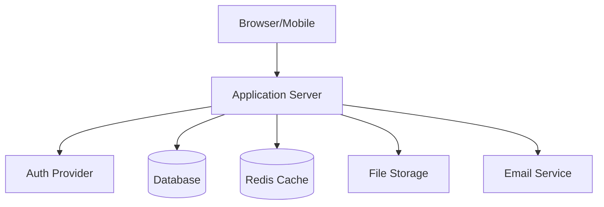
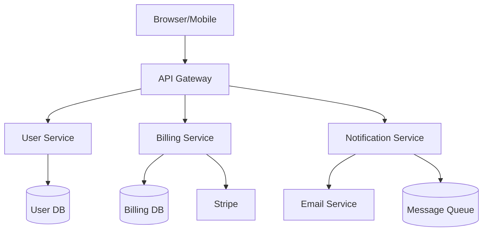
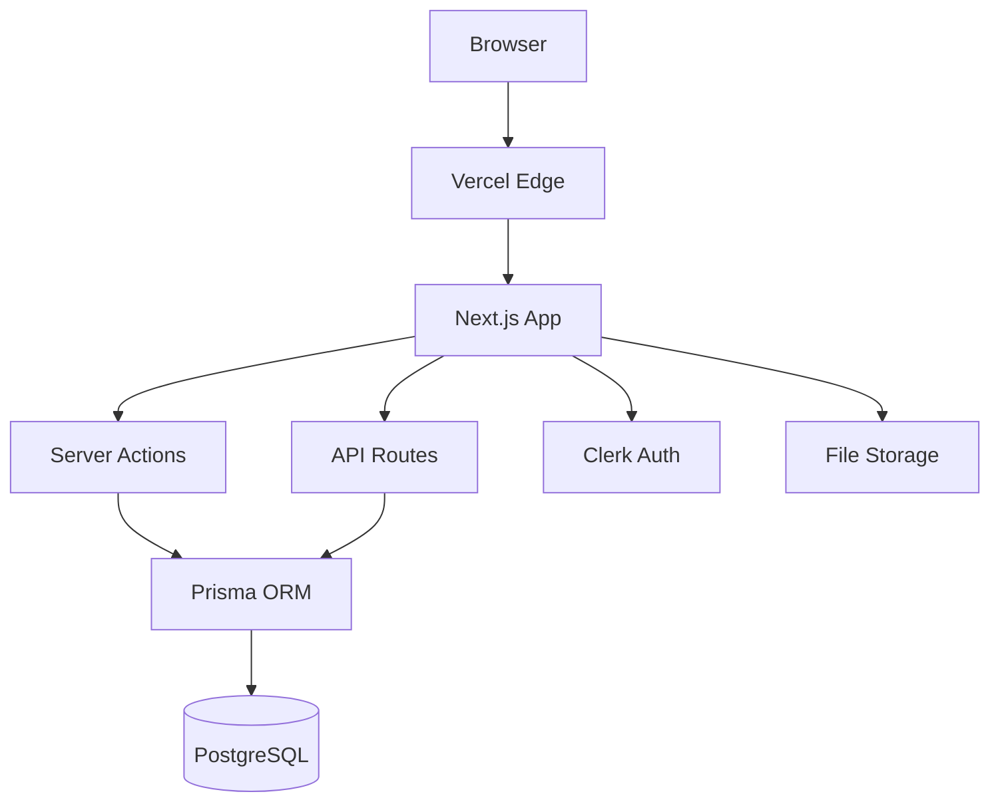

# Architecture Patterns Reference

Use this to recommend and document architecture based on the user's answers.

## Monolith (recommended for most new projects)

### When to recommend
- Solo developer or small team (< 5)
- MVP or early-stage product
- Clear single domain
- Limited DevOps experience

### Structure Pattern
```
project/
├── src/
│   ├── app/              # Entry point, routing, middleware
│   ├── features/         # Feature modules (each self-contained)
│   │   ├── auth/
│   │   │   ├── components/
│   │   │   ├── api/
│   │   │   ├── services/
│   │   │   └── tests/
│   │   ├── billing/
│   │   └── dashboard/
│   ├── shared/           # Shared utilities, components, types
│   ├── lib/              # External service clients, config
│   └── db/               # Database schema, migrations, seeds
├── tests/                # Integration and E2E tests
└── docs/
```

### ARCHITECTURE.md content
```
## Architecture: Modular Monolith

Single deployable unit organized by feature modules. Each feature module is self-contained
with its own components, API routes, services, and tests.

### Key Principle
Features should be loosely coupled. A feature module should only import from shared/ and lib/,
never directly from another feature module. If features need to communicate, use events or
a shared service in shared/.

### Scaling Strategy
When a feature module grows too large or needs independent scaling, extract it into a
separate service. The modular structure makes this extraction straightforward.
```

## Microservices

### When to recommend
- Team of 5+ developers
- Clear bounded contexts
- Need independent scaling of specific services
- Existing infrastructure for service management

### Structure Pattern (monorepo)
```
project/
├── services/
│   ├── api-gateway/      # Routes requests, auth verification
│   ├── user-service/     # User management, profiles
│   ├── billing-service/  # Payments, subscriptions
│   └── notification-service/  # Email, push, SMS
├── packages/
│   ├── shared-types/     # TypeScript types shared across services
│   ├── logger/           # Shared logging
│   └── errors/           # Shared error types
├── infrastructure/
│   ├── docker-compose.yml
│   └── k8s/ (or terraform/)
└── docs/
    └── ARCHITECTURE.md
```

### Inter-Service Communication
- **Synchronous**: HTTP/gRPC between services (via API gateway)
- **Asynchronous**: Message queue (Redis, RabbitMQ, SQS) for events
- **Pattern**: API Gateway → Service → Database (each service owns its data)

## Multi-Tenant Patterns

### Shared Database, Shared Schema (simplest)
- Single database, tenant_id column on every table
- RLS policies or query filters ensure isolation
- Best for: most SaaS apps, lower operational overhead

```sql
-- Every query must include tenant context
SELECT * FROM resources WHERE tenant_id = $1 AND ...
```

### Shared Database, Separate Schemas
- One schema per tenant in the same database
- Better isolation, more operational complexity
- Best for: compliance-heavy industries

### Separate Databases
- One database per tenant
- Maximum isolation, highest operational overhead
- Best for: enterprise customers requiring data isolation guarantees

## Mermaid Diagram Templates

### Monolith Architecture


### Microservices Architecture


### Full-Stack Next.js

