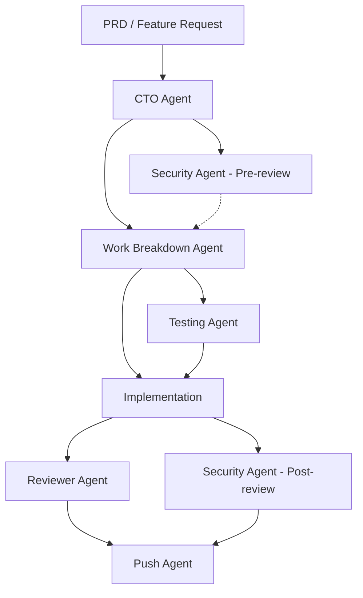

# Multi-Agent Coordination Template

Configure agent pipelines and coordination patterns for complex workflows.
This enables structured handoffs between agents for large features.

## Agent Pipeline Patterns

### Feature Implementation Pipeline

The standard pipeline for implementing a new feature:

```
PRD/Requirement → CTO Agent → Work Breakdown Agent → [Testing Agent + Implementation] → Reviewer Agent → Push Agent
```

**How to invoke a pipeline:**
The user (or a coordinating prompt) invokes each agent in sequence, passing the output
of one as input to the next.

### Pipeline Slash Command

Generate `.claude/commands/pipeline.md`:

```markdown
---
description: Run the full feature implementation pipeline from spec to PR
---

Running feature pipeline for: $ARGUMENTS

## Phase 1: Architecture (CTO Agent)
Invoke the CTO agent with the feature requirement:
- Read the PRD or feature description
- Produce a technical blueprint with data models, API contracts, and component designs
- Save blueprint to `docs/blueprints/{feature-name}.md`

## Phase 2: Work Breakdown
Invoke the work-breakdown agent with the CTO's blueprint:
- Break into implementation phases
- Sequence tasks with dependencies
- Identify what can be done in parallel
- Save plan to `docs/plans/{feature-name}.md`

## Phase 3: Security Review (Pre-implementation)
Invoke the security agent with the blueprint:
- Review the proposed architecture for vulnerabilities
- Flag any security concerns BEFORE code is written
- Document findings in the blueprint

## Phase 4: Implementation
For each task in the work breakdown:
1. Write tests first (if TDD enabled)
2. Implement the code
3. Run tests to verify

## Phase 5: Code Review
Invoke the reviewer agent:
- Check correctness, performance, maintainability
- Verify test coverage
- Check architectural fit against the blueprint

## Phase 6: Security Review (Post-implementation)
Invoke the security agent again:
- Review the actual code for vulnerabilities
- Check for OWASP Top 10 issues
- Verify auth flows and data exposure

## Phase 7: Push
Invoke the push agent:
- Create branch, stage, commit, push
- Create PR with the blueprint as context
```

## Agent Dependency Graph



## Agent Communication Patterns

### Artifact-Based Handoff (Recommended)
Agents communicate through files. Each agent reads from and writes to specific locations:

```
docs/blueprints/        ← CTO agent writes, others read
docs/plans/             ← Work breakdown agent writes, implementer reads
docs/security-reviews/  ← Security agent writes
docs/code-reviews/      ← Reviewer agent writes
```

### Rules for Agent Coordination

Generate `.claude/rules/agent-coordination.md`:

```markdown
# Agent Coordination Rules

## Artifact Locations
- CTO blueprints go in `docs/blueprints/`
- Work breakdown plans go in `docs/plans/`
- Security reviews go in `docs/security-reviews/`
- Code reviews go in `docs/code-reviews/`

## Pipeline Order
When implementing a feature:
1. CTO agent first (architecture)
2. Security agent (pre-review)
3. Work breakdown agent (planning)
4. Testing + Implementation (parallel or sequential based on TDD preference)
5. Reviewer agent (code review)
6. Security agent (post-review)
7. Push agent (git workflow)

## Agent Isolation
- Testing agent MUST run in worktree isolation
- Push agent should have explicit git permissions
- Security agent should have read-only access to code
- CTO agent needs access to ARCHITECTURE.md and existing blueprints
```

## Claude Squad / Parallel Agent Pattern

For teams running multiple Claude instances in parallel (tmux, screen, etc.):

### Lock File Pattern
Prevent two agents from editing the same file simultaneously:

```bash
# Agent acquires lock before editing
LOCK_FILE=".claude/locks/$(echo "$FILE" | md5sum | cut -d' ' -f1).lock"
if [ -f "$LOCK_FILE" ]; then
    echo "File is being edited by another agent. Waiting..."
    sleep 2
fi
echo "$$" > "$LOCK_FILE"

# Agent releases lock after editing
rm -f "$LOCK_FILE"
```

### Coordination File
Generate `.claude/coordination.md` for multi-instance setups:

```markdown
# Multi-Agent Coordination

If running multiple Claude instances simultaneously:

## Lock Directory
Use `.claude/locks/` to prevent file conflicts. Each agent should:
1. Check for locks before editing shared files
2. Create a lock file while editing
3. Remove the lock when done

## Work Assignment
- Assign each Claude instance to a specific task from the work breakdown
- Keep tasks independent to minimize conflicts
- Use the work breakdown plan to identify parallelizable tasks

## Merge Strategy
- Each instance works on a feature branch
- Use `git merge` or `git rebase` to combine work
- Run full test suite after merging
```

## Generation Rules

1. Always generate the `/pipeline` command for team projects
2. Generate `docs/blueprints/`, `docs/plans/`, `docs/security-reviews/` directories
3. Generate `.claude/rules/agent-coordination.md` for projects with 3+ agents
4. Only generate multi-instance coordination if user explicitly mentions
   running multiple Claude sessions in parallel
5. Add the agent dependency graph to ARCHITECTURE.md
