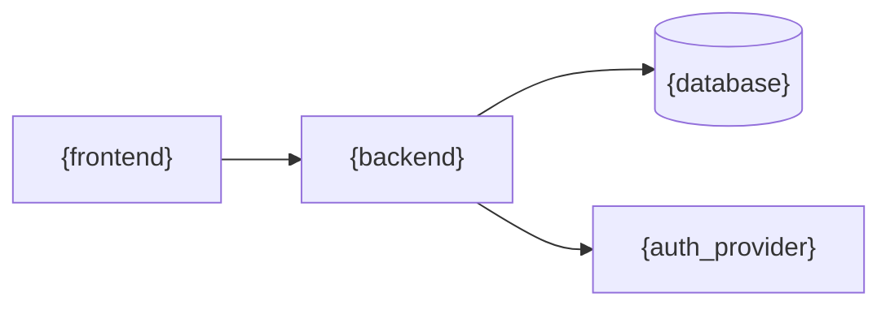

# ARCHITECTURE.md Template

Fill from interview answers. This is the detailed companion to CLAUDE.md.

```markdown
# Architecture — {project_name}

## Overview
{What the project does, who it's for, key features}

## System Architecture

### Component Diagram
{Mermaid diagram showing how components connect}



### Data Flow
1. {Step 1: user action → frontend}
2. {Step 2: frontend → API/server action}
3. {Step 3: API → database}
4. {Step 4: response back to user}

## Key Decisions

| Decision | Choice | Why |
|----------|--------|-----|
| Frontend | {framework} | {rationale} |
| Backend | {framework} | {rationale} |
| Database | {database} | {rationale} |
| Auth | {provider} | {rationale} |
| Hosting | {platform} | {rationale} |

## Directory Structure
{Tree showing the key directories and what lives where}

## Patterns

### Data Access
{How data flows: ORM pattern, repository pattern, direct queries, etc.}

### Error Handling
{Centralized error handler, error types, what gets logged vs shown to user}

### Authentication Flow
{How auth works end-to-end: login → token → middleware → protected routes}

## Environment Variables
See `.env.example` for the complete list. Key variables:
- `DATABASE_URL` — {database connection}
- {other critical env vars}

## Constraints
- {Performance constraint}
- {Security constraint}
- {Business constraint}
```
